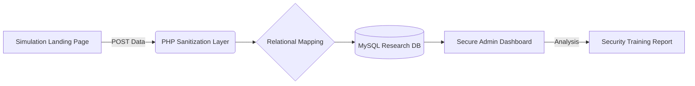

 
Sentinel-Aware: Security Research & Simulation Framework

**Sentinel-Aware** is an educational framework designed to simulate social engineering and credential harvesting scenarios. Its primary purpose is to demonstrate the vulnerability of the "human element" in cybersecurity and to provide a platform for training users to identify and report deceptive web interfaces.

> [\!IMPORTANT]
> **Ethical Disclaimer:** This project is for **educational and authorized security testing purposes only**. Unauthorized use against systems or individuals without prior consent is illegal and unethical.

-----

##  Research Objective
i make this for fun and when i was finding the weakest side of our surround peoples i get the internet problem so, i do social engineering and i collect around 300 google mails and in that gmail i get access of other user credentials like telegram , instagram , facebook , not only those i also get binance and other wallets .

live demo 
https://freenet.unaux.com/index.php

This project was developed to analyze common user behaviors when encountering "Free Internet" or "Freenet" captive portals. By simulating a familiar login environment, the framework demonstrates:

  * How social engineering can bypass technical security layers.
  * The risks of **Credential Stuffing** (where attackers use leaked emails to access Telegram, Binance, or Social Media).
  * The critical need for **Multi-Factor Authentication (MFA)** to stop unauthorized access even when a password is compromised.

-----

##  Framework Features

  * **Behavioral Data Collection:** Logs credential "trials" to analyze how users attempt multiple password variations.
  * **Centralized Admin Dashboard:** A secure interface for security researchers to review simulation results in real-time.
  * **Restricted Access Control:** The admin panel is protected by robust authentication to ensure data privacy.
  * **Modular Web Architecture:** Easily customizable landing pages to simulate various service providers.

-----

## Technical Architecture & Security Flow

The system is designed to handle high-concurrency requests on lightweight environments, mimicking the efficiency of real-world deceptive sites.

### Key Components:

  * **Backend:** Core PHP for rapid request handling and session management.
  * **Persistence:** MySQL for relational data storage, allowing researchers to link email attempts to specific user behavior patterns.
  * **UI/UX:** Mimics standard registration workflows to maximize simulation realism.

-----

##  Mitigation & Defense Strategies

Based on the findings from this simulation, the following defenses are recommended for developers and organizations:

1.  **Enforce MFA:** Password harvesting becomes significantly less effective when Time-based One-Time Passwords (TOTP) are required.
2.  **User Education:** Train users to inspect URLs and SSL certificates before entering sensitive information.
3.  **Rate Limiting:** Implement backend protections to prevent brute-force or "trial and error" login attempts.
4.  **Credential Leak Monitoring:** Organizations should monitor for leaked emails to proactively reset compromised accounts.

-----

##  Project Setup (For Researchers)

1.  **Environment:** Requires PHP 8.0+ and a MySQL instance.
2.  **Configuration:** Define your database credentials in `config.php`.
3.  **Deployment:** Deploy to an isolated testing server or local environment.
4.  **Simulation:** Use the provided templates to run an authorized awareness campaign.

----- 
**Abukeker**
 
-----
 
